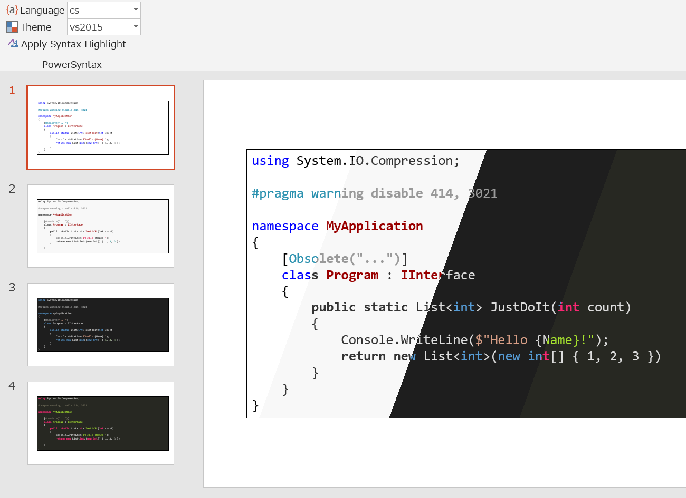

# PowerSyntax

A modern syntax highlighting for PowerPoint.

## How it works?

Run [highlight.js](https://highlightjs.org/) and extract font styles from its result.

## Features

* Generate native PowerPoint font styles. No need to install this add-in to play.
* 185 languages and 89 styles (at 2019-07-11, thanks to [highlight.js](https://highlightjs.org/))

## Installation

Unzip and execute `PowerSyntax.vsto`.

## Usage

1. Choose language and theme.
2. Select text or shape that contains text.
3. Run "Apply Syntax Highlight" command.
